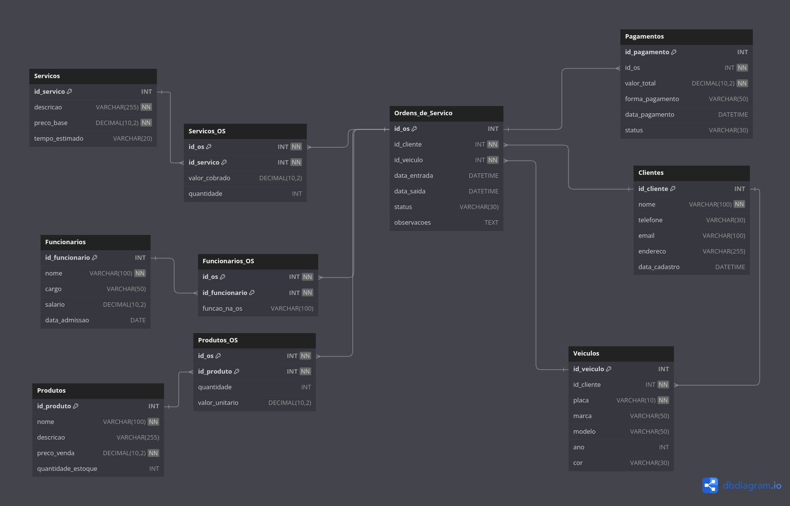

# 📦 Projeto Banco de Dados Oficina Mecânica

Este projeto simula o banco de dados de uma **oficina mecânica**, contendo o registro de clientes, veículos, serviços, produtos, ordens de serviço, funcionários e pagamentos.

Foi desenvolvido para fins educacionais com o objetivo de praticar modelagem, manipulação e análise de dados com SQL. O ambiente é totalmente **automatizado com Docker**.

---

## ⚙️ Tecnologias

- MySQL 8
- Docker / Docker
- Python3
---

## 🚀 Como usar com Docker

### 1. Clonar o repositório

```bash
git clone https://github.com/seu-usuario/mecanica-db.git
cd mecanica-db
```

### 2. Estrutura esperada

```
mecanica-db/
├── Dockerfile
├── README.md
├── DER_mecanica.png
├── requirements.txt
├── script.py
├── .gitignore
└── pdfs/
    ├── 0_init.pdf
    └── Projeto-2-2025.pdf
└── db/
    ├── 0_init.sql
    ├── 1_clientes.sql
    ├── 2_funcionarios.sql
    ├── 3_servicos.sql
    ├── 4_produtos.sql
    ├── 5_veiculos.sql
    ├── 6_ordens.sql
    ├── 7_funcionarios_os.sql
    ├── 8_servicos_os.sql
    ├── 9_produtos_os.sql
    └── 99_pagamentos.sql
```

### 3. Construir e rodar

```bash
docker build -t mecanica-db .
docker run -d -p 3306:3306 --name mecanica_container mecanica-db
```

A imagem criará o banco `mecanica` com todas as tabelas e dados inseridos automaticamente via `.sql` na pasta `/docker-entrypoint-initdb.d/`.

---

## 🧩 Estrutura do Banco de Dados

- **Clientes**: nome, telefone, e-mail, endereço, data do cadastro.
- **Veículos**: placa, modelo, ano, cor e vínculo com cliente.
- **Funcionários**: nome, cargo, salário e data de admissão.
- **Serviços**: descrição, preço base, tempo estimado.
- **Produtos**: nome, descrição, preço e estoque.
- **Ordens de Serviço (OS)**: cliente, veículo, data entrada/saída, status, observações.
- **Serviços_OS**: serviços executados em uma OS.
- **Produtos_OS**: produtos usados em uma OS.
- **Funcionários_OS**: funcionários que trabalharam em uma OS.
- **Pagamentos**: valor total, forma de pagamento, status e vínculo com OS.



---

**Consultas avançadas com:**

(Tabela derivada, GROUP BY, HAVING, WHERE, subselect)

1. **Liste os clientes que possuem mais de 2 ordens de serviço abertas.**

        (GROUP BY, HAVING, WHERE)

2. **Liste os funcionários com a quantidade de ordens de serviço em que participaram, exibindo apenas os que participaram de mais de 3 ordens.**

        (GROUP BY, HAVING)

3. **Mostre os veículos que receberam mais de R$ 1000,00 em serviços, considerando o somatório de valor_cobrado.**

        (Subselect, GROUP BY, HAVING)

4. **Liste os produtos com estoque abaixo da média geral de todos os produtos.**

        (Subselect no WHERE)

5. **Crie uma consulta que use uma tabela derivada para calcular o total gasto por ordem de serviço (produtos + serviços) e filtre as que ultrapassam R$ 500.**

        (Tabela derivada, WHERE)

**Functions (criar 2)**

(Sugestões de perguntas que exigiriam criação de functions)

6. **Crie uma function que receba o id_os e retorne o total da ordem de serviço, somando serviços e produtos.**

7. **Crie uma function que receba o id_funcionario e retorne a quantidade de ordens em que ele participou.**

**Stored Procedures (criar 2)**

(Sugestões que exigem lógica e podem ser reutilizadas)

8. **Crie uma stored procedure que, dado um id_cliente, exiba todas as ordens de serviço dele com total gasto e status.**

9. **Crie uma stored procedure para finalizar uma ordem de serviço, definindo a data_saida atual e alterando o status para 'Concluída'.**

**Views (criar 2)**

10. **Crie uma view que exiba o resumo das ordens de serviço: id, cliente, valor total (serviços + produtos), e status.**

11. **Crie uma view com os produtos mais utilizados em ordens de serviço (com contagem e total em reais usados).**

**Triggers (criar 2)**

12. **Crie uma trigger que, ao inserir um item em Produtos_OS, desconte automaticamente o estoque do produto correspondente.**

13. **Crie uma trigger que, ao inserir um pagamento com status 'Recebido', altere o status da ordem de serviço correspondente para 'Paga'.**

**Extras (índices e performance)**

14. **Compare o tempo de execução de uma consulta que busca ordens de serviço por cliente com e sem índice no campo id_cliente.**

15. **Faça uma consulta que junte várias tabelas (cliente, veículo, OS, pagamento) e otimize-a utilizando índices adequados.**

16. **Desenvolva uma consulta pesada (ex: ordens por mês, total gasto, cliente, status) e otimize seu desempenho.**

    (Com e sem JOINs aninhados, usando EXPLAIN se possível)


## 🧑‍💻 Autor

Feito por AngeloDevNew — [Curso de Inteligência Artificial / Ciência de Dados / Banco de Dados].

---

## 📜 Licença

MIT — Sinta-se livre para usar, modificar e distribuir.